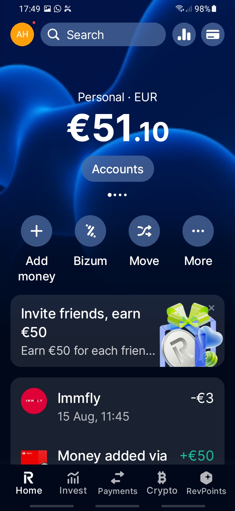
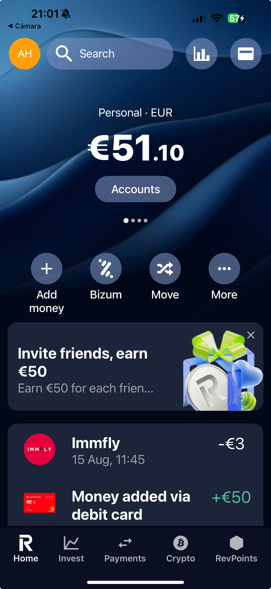

# PGL-AppScreen-Revolut

Este proyecto es una práctica para replicar una pantalla de la aplicación de Revolut como parte de la asignatura **Programación Multimedia y Dispositivos Móviles**.

## Objetivo

El objetivo principal es desarrollar habilidades en el diseño de interfaces móviles utilizando las herramientas y tecnologías vistas en clase.

## Tecnologías utilizadas

## Tecnologías utilizadas

- **Lenguaje de programación:** React Native con TypeScript.
- **Frameworks o librerías:** React Navigation, Styled Components, React Native Vector Icons.
- **IDE:** Visual Studio Code.
- **Herramientas adicionales:** Expo CLI para la gestión del proyecto y emulación.
- **Dependencias principales:**
  - `expo`: Framework para desarrollar aplicaciones React Native.
  - `expo-linear-gradient`: Para crear degradados lineales.
  - `expo-status-bar`: Para gestionar la barra de estado.
  - `react-native-svg`: Para trabajar con gráficos vectoriales.
- **Dependencias de desarrollo:**
  - `typescript`: Lenguaje de programación tipado.
  - `metro-react-native-babel-transformer`: Transformador para trabajar con SVG.
  - `@types/react` y `@types/react-native-vector-icons`: Tipos para TypeScript.
- **Gestión de versiones:** npm para la instalación y gestión de paquetes.
- **Control de versiones:** Git para el seguimiento de cambios en el código.

Estas tecnologías y herramientas permiten un desarrollo eficiente, organizado y escalable de la aplicación.

## Estructura del proyecto

La estructura del proyecto sigue un esquema organizado para facilitar el desarrollo y mantenimiento del código. A continuación, se muestra un árbol de directorios representativo del src:

```markdown
src
├── assets
│ ├── icons
│ └── images
│ ├── backgrounds
│ ├── debit-cards
│ ├── offers
│ └── pfp
├── components
│ ├── common
│ ├── layout
│ └── ui
├── data
├── screens
├── theme
├── types
└── utils
```

### Explicación de la estructura

- **`assets`**: Contiene recursos estáticos como íconos (`icons`) y diferentes categorías de imágenes (`images`), organizados en subcarpetas según su propósito (fondos, tarjetas de débito, ofertas, etc.).
- **`components`**: Incluye los componentes reutilizables de la aplicación, divididos en:
  - `common`: Componentes básicos y genéricos como `Dot`, `Icon`, y `ProfilePicture`.
  - `layout`: Componentes relacionados con la estructura y diseño de la interfaz, como `Header`, `Navbar`, y `TransactionList`.
  - `ui`: Componentes de interfaz de usuario específicos, como botones (`IconButton`, `TextButton`) y elementos interactivos (`SearchBar`, `PaginationDots`).
- **`data`**: Archivos que contienen datos estáticos o simulados, como `balance-cards.ts` y `transactions.ts`.
- **`screens`**: Define las pantallas principales de la aplicación, en este caso, `HomeScreen.tsx`.
- **`theme`**: Contiene configuraciones relacionadas con el diseño visual, como la paleta de colores (`color-palette.ts`) y la tipografía (`typography.ts`).
- **`types`**: Define los tipos de datos utilizados en la aplicación, organizados por entidad (`balance-card`, `button`, `icon`, etc.).
- **`utils`**: Funciones utilitarias reutilizables, como `format-balance.ts`.

Esta estructura modular facilita la escalabilidad, el mantenimiento y la colaboración en equipo, asegurando que cada parte del proyecto esté claramente delimitada y organizada.

Esta estructura permite una separación clara de responsabilidades, facilitando la escalabilidad y el trabajo en equipo.

## Cómo ejecutar el proyecto

1. Clona este repositorio:
   ```bash
   git clone https://github.com/kiara-modo-estudiante/PGL-AppScreen-Revolut
   ```
2. Abre el proyecto en el IDE correspondiente e instala.

   ```bash
   npm install
   ```

3. Ejecuta la aplicación en un emulador o dispositivo físico.
   ```bash
   npm run start
   ```

## Comparación de Imagen y Resultado

A continuación, se presentan las capturas de la pantalla original de la aplicación Revolut y el resultado obtenido en este proyecto, mostradas lado a lado para facilitar la comparación:

<table>
   <tr>
      <td align="center"><strong>Imagen Original</strong></td>
      <td align="center"><strong>Resultado del Proyecto</strong></td>
   </tr>
   <tr>
      <td align="center">
         
      </td>
      <td align="center">
         
      </td>
   </tr>
</table>

## Ejercicios de la Práctica

1. Utiliza alguna herramienta para obtener el código de cada color utilizado en la aplicación y guárdalos en un fichero de TypeScript para los colores de tu aplicación.

   - [01 Color Palette](./docs/01-color-palette.md)

2. Basándote en el principio de Atomic Design, explica cómo has organizado los elementos visuales que conforman la app en componentes core de React Native y los tuyos propios. Recuerda indicar el nombre de los componentes

   - [02 Atomic Design](./docs/02-atomic-design.md)

3. Explica, apoyándote en el código, como has realizado la implementación de algún componente propio.

   - [03 Component Implementation](./docs/03-component-implementation.md)

4. Indica en una tabla cuáles han sido los iconos que has incorporado a tu proyecto y cómo los has implementado. Si son de la misma librería, basta con explicar la implementación de uno.

   - [04 Icons](./docs/04-icons.md)

## Autor

- **Nombre:** Kiara Maldonado García
- **Asignatura:** Programación Multimedia y Dispositivos Móviles
- **Curso:** 2DAM

## Licencia

Este proyecto es solo para fines educativos.
