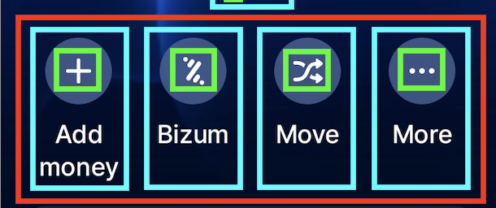

# Atomic Design: Estructura del Proyecto

El principio de Atomic Design es una metodología para crear sistemas de diseño escalables y organizados. Se basa en la descomposición de la interfaz de usuario en cinco niveles jerárquicos: **átomos**, **moléculas**, **organismos**, **plantillas** y **pantallas**. A continuación, se detalla cómo se aplica este principio en el proyecto:

## Estructura de Componentes

| **Componente**    | **Ubicación** | **Nivel** | **Descripción**                                                                 |
| ----------------- | ------------- | --------- | ------------------------------------------------------------------------------- |
| `Dot`             | `/common`     | Átomo     | Indicador circular simple, usado para mostrar posición activa/inactiva.         |
| `Icon`            | `/common`     | Átomo     | Renderiza íconos SVG o de librerías (e.g., `react-native-expo-icons`).          |
| `ProfilePicture`  | `/common`     | Átomo     | Imagen de perfil reutilizable con estilos propios.                              |
| `PaginationDots`  | `/ui`         | Molécula  | Conjunto de puntos de paginación `Dot`.                                         |
| `IconButton`      | `/ui`         | Molécula  | Botón reutilizable que incluye un ícono y, opcionalmente, una etiqueta.         |
| `IconWithLabel`   | `/ui`         | Molécula  | Icono con etiqueta.                                                             |
| `TextButton`      | `/ui`         | Molécula  | Botón que solo muestra texto. Recibe el título y una función `onPress`.         |
| `SearchBar`       | `/ui`         | Molécula  | Barra de búsqueda que combina un `Icon` y un campo de entrada (`TextInput`).    |
| `TransactionItem` | `/ui`         | Molécula  | Representa una transacción (imagen, título, fecha y monto).                     |
| `Header`          | `/layout`     | Organismo | Cabecera principal con `ProfilePicture`, `SearchBar` e `IconButton`             |
| `Navbar`          | `/layout`     | Organismo | Barra de navegación inferior con conjunto de `IconWithLabel`.                   |
| `TransactionList` | `/layout`     | Organismo | Lista completa de transacciones: `TransactionItem`.                             |
| `BalanceCard`     | `/layout`     | Organismo | Tarjeta que muestra el balance de una cuenta. Futura navegación por cuentas.    |
| `PromoCard`       | `/layout`     | Organismo | Tarjeta promocional con texto, imagen e icono de cierre.                        |
| `ActionRow`       | `/layout`     | Organismo | Fila de acciones rápidas con `IconButton` .                                     |
| `HomeScreen`      | `/screens`    | Pantalla  | Pantalla principal que combina organismos como `BalanceCard`, `PromoCard`, etc. |

## Ejemplo visual

A continuación muestro una captura de pantalla de la aplicación donde claramente podemos ver esta jerarquía de componentes:

### Átomos (en verde)

Los componentes más básicos e indivisibles. No tienen dependencias, sino que representan los elementos mínimos de la interfaz.

En este ejemplo agrupa un Icon (átomo) y un Text nativo de React Native (otro átomo). El Icon en este proyecto lo considero un átomo porque solo muestra un símbolo visual, sin lógica ni composición de otros elementos.

### Moléculas (en azul)

Son las combinaciones simples de átomos que juntos forman una unidad funcional. En este caso, IconButton agrupa un Icon (átomo) y un Text (otro átomo), aplicando estilos y comportamiento (por ejemplo, hacerlo circular, con hover, con color de fondo, etc.).

Las moléculas ya tienen propósito: se pueden usar directamente en la interfaz.

### Organismos (en rojo)

Estructuras más complejas, formadas por varias moléculas (y posiblemente átomos). Pueden representar secciones completas de la interfaz. Los organismos ya definen partes completas de la UI, como una barra de herramientas, una tarjeta o un formulario.

Aquí, ActionRow contiene varios IconButton alineados en una fila, actuando como un conjunto de acciones (por ejemplo, "Añadir dinero", "Bizum").
De esta manera, estamos organizando nuestro proyecto adecuadamente siguiendo la jerarquía de Atomic Design.

## Justificación de la ausencia de plantillas

En este proyecto no se han definido plantillas porque las pantallas (`screens`) están diseñadas directamente a partir de organismos y moléculas. Esto permite una mayor flexibilidad en la composición de las páginas, ya que cada pantalla puede tener una estructura única sin necesidad de una plantilla intermedia. Además, la ausencia de plantillas simplifica la jerarquía del proyecto, lo que puede ser beneficioso en proyectos pequeños o medianos donde la reutilización de estructuras completas no es una prioridad.

## Recursos adicionales

### Temas y estilos globales

📂 **`src/theme`**

- `color-palette.ts` → Define la paleta de colores global.
- `typography.ts` → Establece estilos tipográficos reutilizables.

### Utilidades

📂 **`src/utils`**

- `format-balance.ts` → Utilidad para formatear montos y balances.

### Datos de ejemplo

📂 **`src/data`**

- `balance-cards.ts` → Datos mock para las tarjetas de balance.
- `transactions.ts` → Datos mock para las transacciones.

---

Con esta estructura, el proyecto sigue el principio de Atomic Design, lo que facilita la escalabilidad, la reutilización y el mantenimiento de los componentes.
