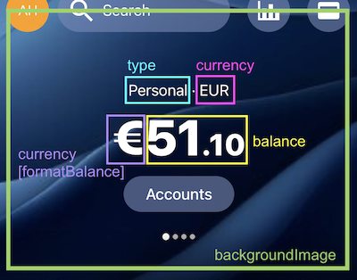
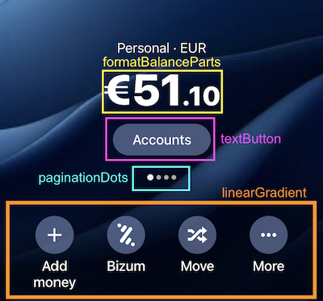

# Implementación del Componente BalanceCard

El componente `BalanceCard` es un organismo dentro de la arquitectura de Atomic Design. Su propósito es mostrar información sobre una cuenta bancaria, como el tipo de cuenta, la moneda, el saldo y un botón para acceder a más detalles. Además, incluye elementos visuales como un fondo con degradado y puntos de paginación.

## Enlace al Componente

El código completo del componente `BalanceCard` está disponible en el siguiente enlace:

[BalanceCard Component](/src/components/layout/BalanceCard.tsx)

## Estructura del Componente

El componente está definido como un Functional Component de React con TypeScript. Utiliza las siguientes dependencias y utilidades:

### Props

Las props del componente están definidas en la interfaz `BalanceCardProps`, que extiende `BalanceAccount`. Esto asegura que el componente reciba datos como:

- **backgroundImage**: Imagen de fondo de la tarjeta.
- **type**: Tipo de cuenta (e.g., "Personal").
- **currency**: Moneda de la cuenta (e.g., "EUR").
- **balance**: Saldo de la cuenta.
- **style**: Estilo opcional para personalizar el contenedor.



### Dependencias Importadas

- **formatBalanceParts**: Función que formatea el saldo en partes (símbolo, parte principal, centavos).
- **LinearGradient**: Componente de `expo-linear-gradient` para aplicar un degradado en la parte inferior de la tarjeta.
- **TextButton**: Botón reutilizable que muestra texto.
- **PaginationDots**: Componente que muestra puntos de paginación.



## Código del Componente

### Declaración y Formateo del Saldo

El saldo se formatea utilizando la función `formatBalanceParts`, que divide el saldo en tres partes:

1. **Símbolo de la moneda** (e.g., €).
2. **Parte principal** (e.g., 51).
3. **Centavos** (e.g., 10).

### Renderizado Principal

El componente utiliza un contenedor principal (`View`) con un fondo (`ImageBackground`) y un degradado (`LinearGradient`). Dentro de este contenedor, se renderizan los siguientes elementos:

#### Descripción de la Cuenta

- Muestra el tipo de cuenta y la moneda.
- Usa estilos tipográficos definidos en `typography.ts`.

#### Saldo Formateado

- Muestra el símbolo, la parte principal y los centavos del saldo.
- Los centavos tienen un estilo más pequeño para diferenciarlos visualmente.

#### Botón de Acción

- Un botón reutilizable (`TextButton`) que ejecuta una acción al presionarlo.

#### Puntos de Paginación

- Utiliza el componente `PaginationDots` para indicar la posición actual en la lista de cuentas.

#### Degradado

- Un degradado en la parte inferior para mejorar la legibilidad del texto sobre el fondo.

## Estilos del Componente

Los estilos están definidos utilizando `StyleSheet.create` y se aplican a los elementos del componente. Algunos puntos clave:

- **Contenedor Principal**:

  - Ocupa el 100% del ancho y tiene una altura fija de 520.
  - Asegura que todos los elementos estén alineados correctamente.

- **Imagen de Fondo**:

  - Se ajusta al tamaño completo del contenedor.
  - Proporciona un diseño visual atractivo.

- **Degradado**:

  - Posicionado en la parte inferior del contenedor.
  - Mejora la legibilidad del texto.

- **Texto de Centavos**:
  - Tamaño de fuente más pequeño para diferenciarlo del saldo principal.

## Datos de Ejemplo

El componente utiliza datos de ejemplo definidos en `balance-cards.ts`. Cada tarjeta incluye:

- Una imagen de fondo.
- Tipo de cuenta.
- Moneda.
- Saldo.

### Ejemplo de Datos

```typescript
const balanceCards = [
  {
    backgroundImage: require("./assets/card-bg.png"),
    type: "Personal",
    currency: "EUR",
    balance: 5123.1,
  },
  {
    backgroundImage: require("./assets/card-bg-2.png"),
    type: "Business",
    currency: "USD",
    balance: 10450.75,
  },
];
```

## Utilidad Asociada: formatBalanceParts

La función `formatBalanceParts` divide el saldo en partes para facilitar su renderizado. Por ejemplo:

```typescript
formatBalanceParts(5123.1);
// Resultado: { symbol: '€', main: '5123', cents: '10' }
```

## Conclusión

El componente `BalanceCard` es un ejemplo de cómo combinar Atomic Design con React Native para crear un organismo reutilizable y funcional. Utiliza datos dinámicos, estilos globales y componentes reutilizables para garantizar consistencia y escalabilidad en el diseño de la aplicación.
