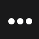

# Manejo de Iconos en la Aplicación

En esta aplicación, los iconos se gestionan de manera flexible utilizando una combinación de iconos vectoriales de `react-native-vector-icons` y archivos SVG personalizados. Esto permite reutilizar iconos existentes y agregar nuevos iconos personalizados según sea necesario.

## Implementación del Componente Icon

[Icon Component](/src/components/common/Icon.tsx)

El componente `Icon` es un componente reutilizable que permite renderizar tanto iconos de la librería `react-native-vector-icons` como iconos SVG personalizados. Este componente acepta las siguientes props:

- **name**: Nombre del icono (por defecto, `"default-icon"`).
- **size**: Tamaño del icono.
- **color**: Color del icono.

### Lógica del Componente

1. **Iconos SVG Personalizados**:

   - Se utiliza un objeto `svgIcons` que mapea nombres de iconos a sus respectivos archivos SVG.
   - Si el nombre del icono coincide con una clave en `svgIcons`, se renderiza el icono SVG correspondiente utilizando las props `width`, `height` y `fill`.

2. **Iconos de MaterialCommunityIcons**:
   - Si no se encuentra un icono SVG con el nombre especificado, se utiliza el componente `MaterialCommunityIcons` para renderizar un icono de la librería `react-native-vector-icons`.

### Código del Componente Icon

```tsx
import React from "react";
import MaterialCommunityIcons from "react-native-vector-icons/MaterialCommunityIcons";
import { svgIcons } from "../../assets/icons";
import { IconProps } from "../../types/icon";

const Icon: React.FC<IconProps> = ({ name = "default-icon", size, color }) => {
  const SvgIcon = svgIcons[name as keyof typeof svgIcons];

  if (SvgIcon) {
    return <SvgIcon width={size} height={size} fill={color} />;
  }

  return <MaterialCommunityIcons name={name} size={size} color={color} />;
};

export default Icon;
```

## Gestión de Iconos SVG

Los iconos SVG personalizados se almacenan en la carpeta `src/assets/icons` y se exportan a través de un índice centralizado (`index.ts`). Esto permite agregar nuevos iconos fácilmente y mantener el código organizado.

### Archivo `index.ts`

```typescript
import RevolutSvg from "./revolut.svg";
import BizumSvg from "./bizum.svg";

export const svgIcons = {
  revolut: RevolutSvg,
  bizum: BizumSvg,
};
```

### Agregar un Nuevo Icono SVG

1. Coloca el archivo SVG en la carpeta `src/assets/icons`.
2. Importa el archivo en `index.ts` y agrégalo al objeto `svgIcons` con una clave única.

```typescript
import NewIconSvg from "./new-icon.svg";

export const svgIcons = {
  ...existingIcons,
  newIcon: NewIconSvg,
};
```

## Ejemplo de Uso del Componente Icon

El componente `Icon` se puede utilizar en cualquier parte de la aplicación para renderizar iconos. Aquí hay algunos ejemplos:

### Renderizar un Icono SVG

```tsx
<Icon name="revolut" size={24} color="#000" />
```

### Renderizar un Icono de MaterialCommunityIcons

```tsx
<Icon name="account" size={24} color="#000" />
```

## Iconos Utilizados

| Icono                                                  | Nombre del Icono | Tipo                   | Descripción                      | Ubicación en la Aplicación            |
| ------------------------------------------------------ | ---------------- | ---------------------- | -------------------------------- | ------------------------------------- |
|             | revolut          | SVG                    | Icono personalizado de Revolut.  | Barra de navegación (Home)            |
|                 | bizum            | SVG                    | Icono personalizado de Bizum.    | Botones de acciones rápidas           |
|                      | close            | MaterialCommunityIcons | Icono de cerrar.                 | Tarjeta de promoción                  |
|                  | magnify          | MaterialCommunityIcons | Icono de búsqueda.               | Barra de búsqueda en Header           |
|                        | plus             | MaterialCommunityIcons | Icono de añadir.                 | Botones de acciones rápidas           |
|  | shuffle-variant  | MaterialCommunityIcons | Icono de aleatorizar.            | Botones de acciones rápidas           |
|  | dots-horizontal  | MaterialCommunityIcons | Icono de opciones.               | Botones de acciones rápidas           |
|              | chart-bar        | MaterialCommunityIcons | Icono de gráfico de barras.      | Botón en el Header                    |
|          | credit-card      | MaterialCommunityIcons | Icono de tarjeta de crédito.     | Botón en el Header                    |
|                  | hexagon          | MaterialCommunityIcons | Icono de hexágono.               | Botón en el Header                    |
|            | chart-line       | MaterialCommunityIcons | Icono de gráfico de línea.       | Botón en el Header                    |
|  | swap-horizontal  | MaterialCommunityIcons | Icono de intercambio horizontal. | Botón en el Header                    |
|                  | bitcoin          | MaterialCommunityIcons | Icono de Bitcoin.                | Botón en el Header                    |
| ---                                                    | default-icon     | MaterialCommunityIcons | Icono predeterminado.            | Usado como fallback en el componente. |

## Conclusión

El manejo de iconos en esta aplicación combina la potencia de `react-native-vector-icons` con la personalización de iconos SVG. Esto asegura que la aplicación sea visualmente consistente y fácil de mantener, al mismo tiempo que permite adaptarse a requisitos específicos de diseño.
